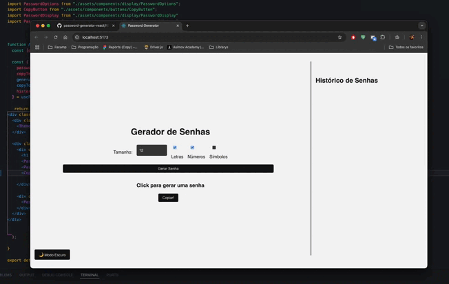

<p align="center">
  
  
  
</p>

<h1 align="center">🔐 Password Generator</h1>
<p align="center">
  A sleek, customizable <strong>Password Generator</strong> built with <strong>React + Vite</strong>.<br />
  Designed with modern UI/UX in mind — featuring Dark Mode, clipboard copy, password history, and modular architecture with custom hooks.
</p>

---

## 📸 Preview



[](https://www.youtube.com/watch?v=arS2tTEC-W0)

## ⚙️ Tech Stack

⚛️ React – Modern UI library with hooks

⚡ Vite – Blazing fast bundler

🎨 CSS Modules – Scoped and maintainable styles

🌘 Dark Mode – Seamless theme toggle

🧠 Custom Hooks – useDarkMode, usePasswordGenerator

📋 Clipboard API – Quick copy with feedback

🗂️ History Log – Track generated passwords

💾 LocalStorage – Persist password history (optional)

## ✨ Features
| Feature                      | Status  |
| ---------------------------- | ------- |
| 🔐 Generate secure passwords | ✅ Done |
| 🎛️ Customizable options     | ✅ Done |
| 📋 Copy to clipboard         | ✅ Done |
| 📜 Password history          | ✅ Done |
| 🌗 Dark/Light mode toggle    | ✅ Done |
| ♻️ Reusable components/hooks | ✅ Done |

## 🔧 Getting Started
1. Clone the project
```bash
git clone https://github.com/your-username/password-generator-react.git
cd password-generator
```
2. Install dependencies
```bash
npm install
```
3. Start the development server
```bash
npm run dev
```
4. Open in your browser
http://localhost:5173

## 🧪 Testing & Usage
- Click "Generate Password" to create a new password
- Choose your preferred length and character set
- Click "Copy" to send the password to your clipboard
- View previously generated passwords in the history log
- Toggle between Dark and Light themes anytime

## 📁 Project Structure (Simplified)
```bash
📦 src
├── components/          # UI Components (Buttons, Toggles, Displays)
├── hooks/               # Custom hooks (useDarkMode, usePasswordGenerator)
├── styles/              # CSS Modules
└── App.jsx              # Main app entry point
```


